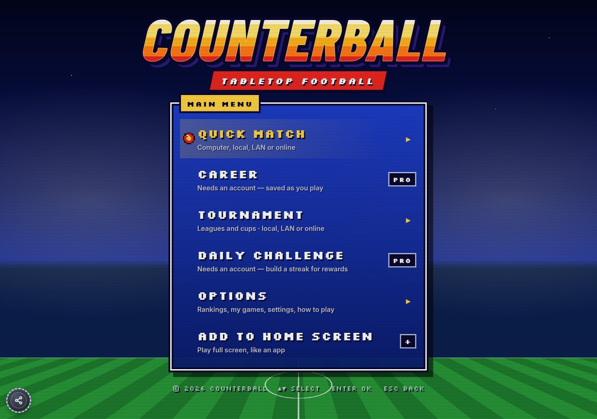

# CAPBALL

A browser game inspired by tabletop bottle-cap football. Players take turns flicking caps to move the ball and score, on a 3D pitch with a broadcast-style presentation.

[Play CAPBALL](https://capball.vercel.app/)



## Features

- Local two-player matches, a computer opponent (easy / medium / hard), and online matches with a room code or invite link.
- Team builder (name, colours, badge, pattern, finish), four venues, and four formations that set the kick-off layout.
- Drag-and-release flick controls with an aim arrow and ball-contact preview.
- Two halves with a change of ends, fouls, free kicks with a wall, penalties, and a penalty shootout with sudden death.
- Works on phones: the pitch turns upright in portrait and the layout adapts.

## Built with

React 19 and Vite 8; Three.js and React Three Fiber for rendering; Matter.js for physics; Zustand for state; PeerJS for online play; Vitest and ESLint for checks.

## Run locally

```bash
git clone https://github.com/andex23/capball.git
cd capball
npm install
npm run dev
```

Use the local URL printed by Vite.

| Command | What it does |
| --- | --- |
| `npm run dev` | Start the dev server |
| `npm test` | Run the unit tests once (`npm run test:watch` to keep watching) |
| `npm run lint` | Lint the code |
| `npm run check` | Lint, test and build — the same as CI |
| `npm run build` / `npm run preview` | Build for production and serve the build |

### Online play

Online matches use the free public PeerJS server by default. To use your own [PeerJS server](https://github.com/peers/peerjs-server), set these before building:

```bash
VITE_PEER_HOST=peer.example.com VITE_PEER_PORT=443 VITE_PEER_PATH=/ VITE_PEER_SECURE=true npm run build
```

The host runs the physics and rules; the guest sends requests (edit its own team, ready up, flick its own caps on its own turn), and the host validates every one before applying it. At full time both players pick Rematch (or Penalty shootout after a draw) and it starts once they agree.

#### Relay (TURN) servers

Players connect directly using public STUN servers (`stun:stun.l.google.com:19302`). Some networks — lots of mobile data, office and school Wi-Fi — block direct connections, and then the traffic has to go through a relay (TURN) server. None is built in, because relays cost money to run; without one, those players see *"Couldn’t connect directly — one of you may be on a strict network…"* (PeerJS's own best-effort public relay is still tried when you don't configure one).

To add a relay, set either or both of these before building:

| Variable | Example |
| --- | --- |
| `VITE_ICE_SERVERS` | JSON array of [RTCIceServer](https://developer.mozilla.org/en-US/docs/Web/API/RTCIceServer) objects: `[{"urls":"turn:turn.example.com:3478","username":"u","credential":"p"}]` |
| `VITE_TURN_URL` | `turn:turn.example.com:3478` (comma-separate several, e.g. add `turns:turn.example.com:5349?transport=tcp`) |
| `VITE_TURN_USERNAME` / `VITE_TURN_CREDENTIAL` | the relay's username and password |

```bash
VITE_TURN_URL=turn:turn.example.com:3478 VITE_TURN_USERNAME=capball VITE_TURN_CREDENTIAL=secret npm run build
```

They're added to the STUN defaults; malformed entries (bad JSON, TURN urls without a username and credential) are ignored. Any TURN service works — for example [Metered](https://www.metered.ca/stun-turn) or [Twilio Network Traversal](https://www.twilio.com/docs/stun-turn) (both have free tiers and give you the urls and credentials to paste in), or your own [coturn](https://github.com/coturn/coturn) server. These values end up in the public JavaScript bundle, so use credentials meant for browsers (Metered and Twilio can issue restricted or short-lived ones) rather than an account password.

#### Dropped connections

If the link drops during setup or a match, the host keeps the room open and pauses the match for up to a minute while the guest reconnects automatically (retrying after 1 s, 2 s, 4 s … ). The host sends the full match state again when the guest is back and play resumes after a short "back" notice. When the host first accepts a guest it gives it a random session token; only a guest presenting that token can rejoin a room, so nobody else can take over a match in progress. Pressing Leave (or closing the tab) tells the other player straight away.

## Rules at a glance

- Teams alternate turns; a turn ends when everything stops moving.
- No goal straight from a kick-off flick. Goalkeepers can't score, but an own goal off a keeper counts.
- Hitting an opponent's cap before the ball is a foul (a cushion bounce first is fine): free kick, or a penalty if it's in the offender's own area.
- A drawn match can go to a shootout: best of three each, then sudden death.

## Code map

| Path | Purpose |
| --- | --- |
| `src/game/` | Pure match rules (goals, fouls, shootout) and flick validation |
| `src/state/` | Match state and flow (Zustand store) |
| `src/physics/` | Physics world, set-piece layouts, goal detection |
| `src/scene/` | Pitch, ball and cap rendering; camera presets |
| `src/input/` | Flick controls |
| `src/ai/` | Computer opponent |
| `src/multiplayer/` | PeerJS connection and the validated online protocol |
| `src/screens/`, `src/ui/` | Menus, setup flow, HUD and shared UI |
| `src/styles/theme.css` | Design tokens and component styles |
| `src/__tests__/` | Unit and physics simulation tests |
| `src/sw.js`, `src/pwa/` | Offline service worker (production builds only), install prompt, update toast |
| `scripts/generate-icons.js` | Renders the app icons in `public/icons/` (`node scripts/generate-icons.js`) |


### Online tournament team editing

Run [supabase/team-editing.sql](supabase/team-editing.sql) in the Supabase SQL Editor after the tournament schema. Existing projects only need this migration; no tournament data is reset.

Friends choose an open seat and edit their own team name, colours, cap designs and squad in the hub. Saves are shared through `cb_update_team`. The database checks seat ownership, preserves team IDs and fixtures, and prevents edits while a match room is open or the tournament is closed. The host must claim a seat to edit that team's identity too.

## Play anytime (saved online turns)

Live rooms still use PeerJS and their existing clocks. **Online → Play anytime**
uses account-backed server turns: create a match, share its 10-character code,
play and leave, then resume from My matches on any signed-in device. Casual
matches have no deadline and give each player 10, 20 or 30 shots. Tied cup games
continue to penalties. In this mode penalty keepers hold the centre.

Hosted cups/leagues can also choose Play anytime with no deadline, 24 hours or
48 hours per turn. Each friend needs their own account and team seat. Both
players must open a fixture before its deadline starts. Missing a deadline or
resigning forfeits the fixture 3–0; closing the app does not suspend deadlines.
The hub settles overdue fixtures when it refreshes. Results and match completion
are written in one transaction. Team edits apply to the next match; a match's
teams are fixed when both players have accepted it.

Deployment prerequisites:

1. Apply `supabase/anytime.sql` after `tournaments.sql` and `accounts.sql`.
   `/setup-anytime.html` provides a Copy SQL button for phones.
2. Set **server-only** `SUPABASE_SERVICE_ROLE_KEY` in Vercel Production and
   redeploy. Optional `SUPABASE_URL` overrides the default CAPBALL project.
   Never prefix this key with `VITE_` or commit it.
3. The Vercel Node function `/api/anytime` validates the account and resolves
   shots using the same Matter physics and scoring rules as the game. Only
   that function can invoke `cb_anytime_service`; public clients cannot write
   results or board positions. Requests carry a version and idempotency UUID.

Locally put the server key in ignored `.env.local`, run `npm run dev:api`, then
`npm run dev` in another terminal. Vite proxies only `/api/anytime` to port 3001.
`npm run check` includes PostgreSQL integration tests (PGlite) for account
ownership, resumption, retries, concurrent turns, deadlines and competition
results. It does not require production credentials.


## Offline LAN matches

Load or install CapBall on both devices before disconnecting from the internet.
Connect to the same Wi-Fi or phone hotspot, then open **Quick Match → LAN Match**.
The guest scans the host invite; the host scans the guest reply. Full-code
copy/paste is also available. Choose teams and start the match.

LAN uses a native WebRTC data channel with host-only ICE and no STUN, TURN,
PeerJS signaling, account, or backend dependency. The host runs authoritative
physics and validates guest input using the existing multiplayer protocol.
Brief app/background or network interruptions pause LAN matches for up to two
minutes while the existing WebRTC channel recovers. Fresh round-trip probes
confirm both apps are active before the host resumes its clock and physics.
Scores, board positions, turns and pre-existing pauses are preserved. Closing
or reloading a tab, a permanently closed channel, or an expired recovery window
ends the session; start a new match in those cases.
Camera scanning needs HTTPS and camera permission. Networks with client
isolation may prevent device-to-device connections.

### Lagos Life integration preparation

The dedicated integration branch tracks the
[readiness plan and code integration points](docs/integrations/lagos-lifestyle.md).
The planned flow is embedded play with existing Lagos Life accounts and purchases
using its in-game money. Implementation depends on the official API contract;
no partner features are enabled yet.
